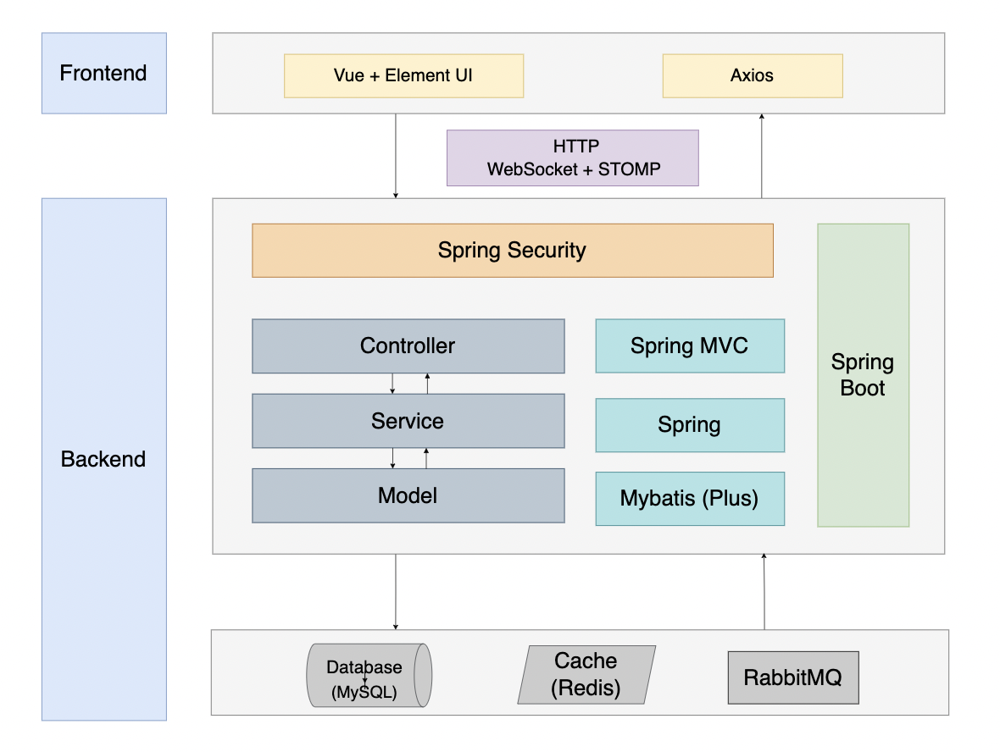
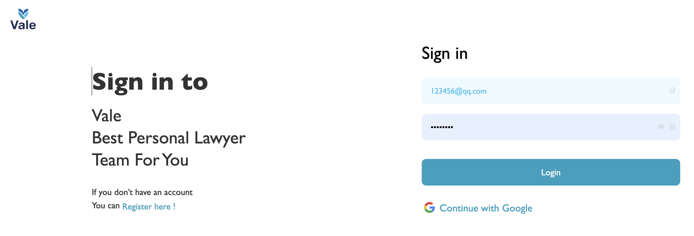
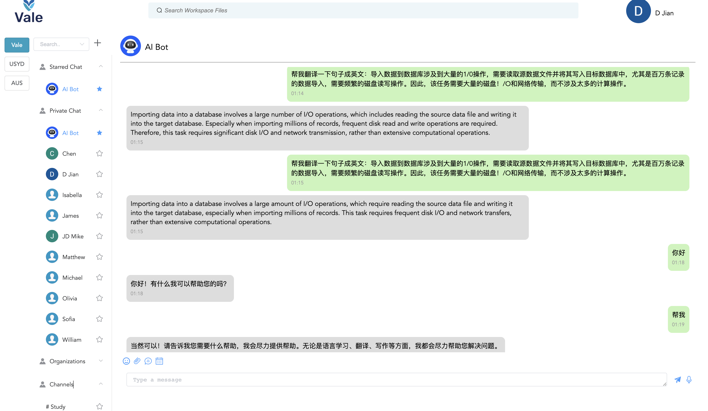
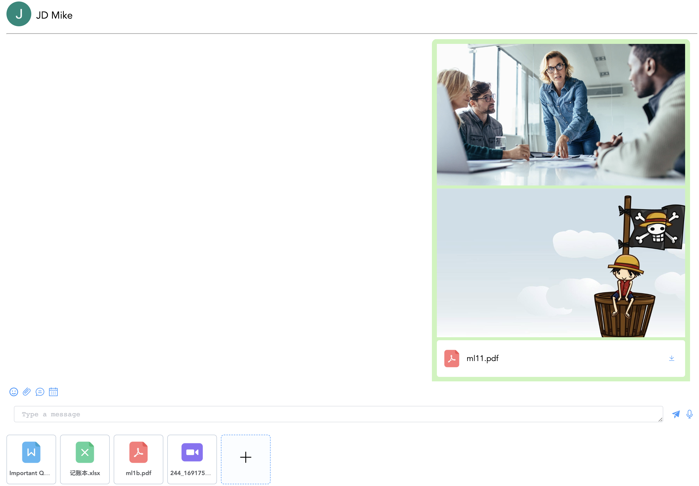
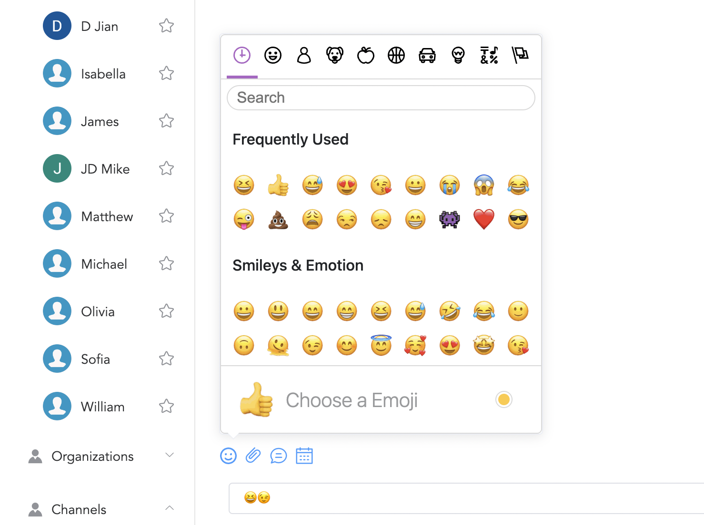
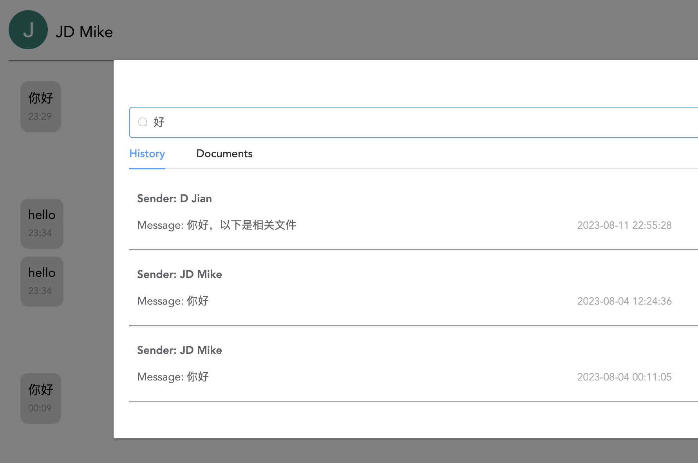
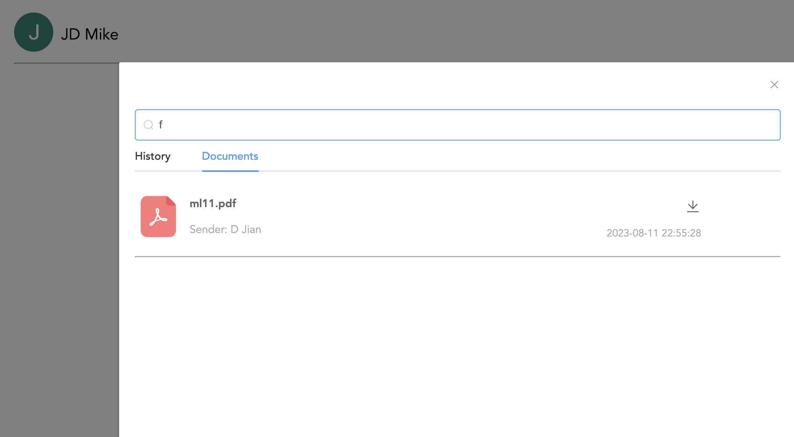
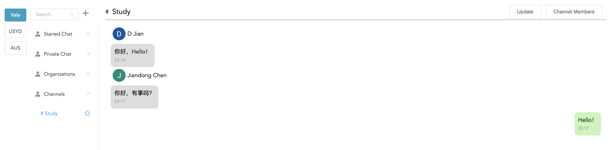
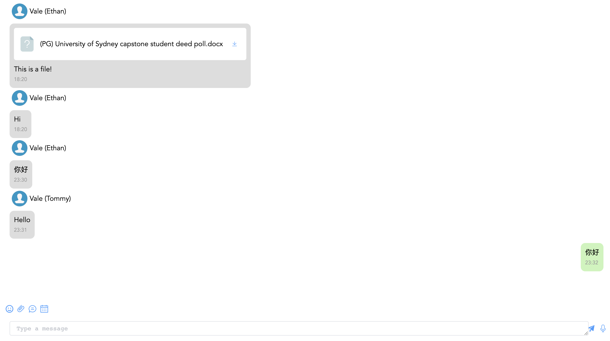
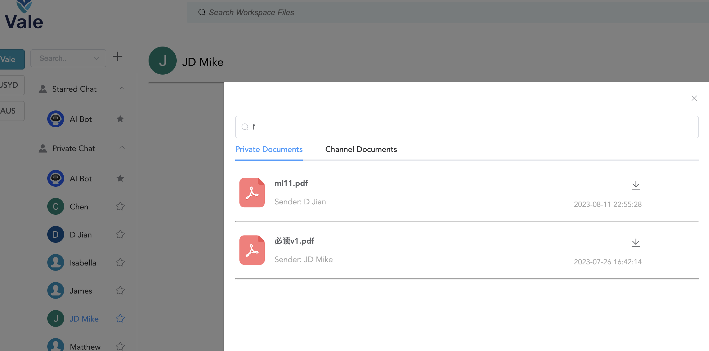

# ValeChat

## 项目介绍

- 该平台用于团队协作和沟通，支持群聊、私聊等功能。

- 用户可发送和接收文本、表情、语音和视频、以及各种类型的文件，并且支持搜索、查看历史消息和文件。
- 用户可与 AI 进行对话
- 其他功能：用户之间可以预约会议等

> 此项目是前后端分离项目，前端目前有待完善。。。
>
> 部署在准备中，待完善。。。
>
> 部分功能待完善。。。

## 技术选型与架构设计

### 前端技术栈

- Vue
- Element UI
- Axios

### 后端技术栈

- Spring Boot
- MySQL
- MyBatis-Plus
- WebSocket
- Redis
- RabbitMQ
- Spring Security（待完善，可去除）

## 架构设计

待完善。。。

## 功能介绍

1. **注册与登录：**
   - 用户可注册为普通用户和组织用户（组织用户之后要改成邀请制）。
   - 登录包括普通登录和谷歌登录。
2. **私聊功能：**
   - 支持消息的发送、接收和提醒（名字加粗）。
   - 消息类型包括了：消息、表情、图片、视频、语音和其他类型的文件。
   - 用户可以发送文本消息的同时，添加多个文件一起发送。
   - 用户可以查看和搜索历史消息、历史文件
3. **群聊功能：**
   - 大部分功能与私聊类似。
   - 用户可以创建和管理群组，在群聊中可以 @某个用户。
   - 创建群聊后待增加更新 Redis 缓存功能。。。
4. **组织聊天：**
   - 基于群聊功能，当普通用户与某个组织聊天时，是与该组织中的多个组织成员在聊天（类似淘宝客服）。
5. **文件系统：**
   - 划分：工作区 —> 私聊 —> 个人（或群聊 —> 群组 ID）
6. **工作区（待完善）：**
   - 目前是当用户注册后会自动加入固定的工作区进行聊天，之后会修改成邀请制：用户创建工作区后，可邀请其他用户加入该工作区（类似 slack 的workspace）。
   - 一个用户可以存在于多个工作区，并可进行切换。
   - 用户可以在工作区中搜索历史消息和文件（包括了私聊和群聊中的）。
7. **预约功能：**
   - 用户可以在聊天框中点击日历按钮，向对方进行预约（会议等），该功能调用了第三方的 API。
   - 目标用户会在邮件中收到预约信息。
8. **个人中心：**
   - 用户可以修改个人信息（包括头像等）。
9. **用户聊天列表：**
   - 在线用户列表：后端已实现相关接口。前端暂未添加该功能。
   - 分为四块：置顶的列表、私聊列表、组织聊天列表和群聊列表。
10. **AI 模块：**
    - 用户可以 AI 进行对话（支持异步化），向 AI 发出消息后，请求完成后实时通知用户。
    - AI 扩展功能待完善。。。

## 项目成果

部分成果展示：

### 注册与登录模块

### AI 模块

​	

### 聊天模块

- 文本 + 多文件发送：

  

- Emoji

  

- 历史消息和文件搜索：

  

  

- 群聊：

  

- 组织聊天：

  

### 文件系统

- 工作区文件搜索

  

。。。

## 快速开始

1. 配置相关库：MySQL、Redis、RabbitMQ 等
2. 创建数据库和表：vale_chat.sql 中的所有表
3. 插入模拟数据：simulation.sql 中的数据

## 待改进

1. 前端刷新页面时，选择某个聊天，只向后端发送了已读该消息请求。未发送读取历史消息请求。
2. 聊天列表改变时，未更新缓存，例如创建群组
3. 前端暂未实现在线用户列表
